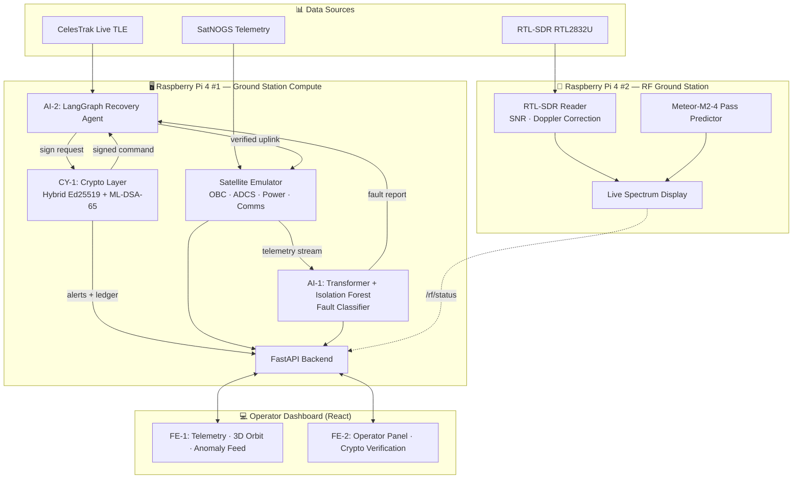
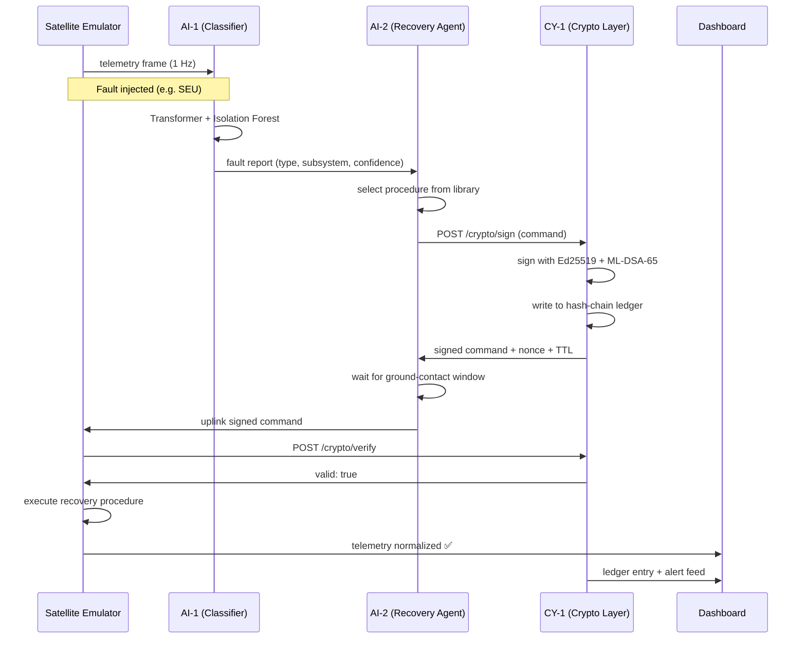

<div align="center">

# 🛰️ DeadSat Resurrection

### Autonomous Cyber-Forensic Recovery for Bricked Satellites

**Far Away 2026 · India's Largest International Hackathon · Japan Grand Finale**

[](https://www.python.org/)
[](https://fastapi.tiangolo.com/)
[](https://react.dev/)
[](https://www.raspberrypi.com/)
[](#-security-architecture)
[](#-roadmap)
[](#license)

<sub>


</sub>

</div>

<br/>

> *When **NOAA-18** went dark mid-development, it became the exact scenario this project exists to solve. Had DeadSat Resurrection been watching, it would have diagnosed the fault, ruled out a cyberattack, and uplinked a cryptographically signed — and quantum-resistant — recovery command in under 90 seconds.*

---

## 📌 At a Glance

| | |
|---|---|
| ⏱️ **Recovery time** | < 90 seconds — vs. **48–96 hours** manual ground-ops |
| 💰 **Cost of failure addressed** | ₹200–5,000 crore per bricked satellite |
| 🧠 **Fault types diagnosed** | SEU · Software Bug · Firmware Corruption · Command Injection |
| 🔐 **Signature schemes required** | **2** — Ed25519 *and* ML-DSA-65 (NIST FIPS 204), both must verify |
| 🛰️ **Ledger integrity checks** | Every **10 seconds**, automatically, with live alerting |
| 🖥️ **Ground station hardware** | 2 × Raspberry Pi 4 (4 GB) + RTL-SDR (RTL2832U) |
| 📡 **Live satellite tracked** | Meteor-M2-4 @ 137.9 MHz, NORAD 59051 |
| 🌍 **Telemetry baseline** | Seeded from real [SatNOGS](https://satnogs.org/) observations |

---

## Table of Contents

- [The Problem](#-the-problem)
- [The Solution](#-the-solution)
- [What Makes This Different](#-what-makes-this-different)
- [Live System Proof](#-live-system-proof)
- [System Architecture](#-system-architecture)
- [Anatomy of a Recovery](#-anatomy-of-a-recovery)
- [90-Second Demo Script](#-90-second-demo-script)
- [Security Architecture](#-security-architecture)
- [RF Ground Station](#-rf-ground-station)
- [AI Layer](#-ai-layer)
- [Frontend](#-frontend)
- [Tech Stack](#-tech-stack)
- [Project Structure](#-project-structure)
- [Getting Started](#-getting-started)
- [API Reference](#-api-reference)
- [FAQ](#-faq)
- [Roadmap](#-roadmap)
- [Data Sources & Acknowledgments](#-data-sources--acknowledgments)
- [Team](#-team)
- [Hardware](#-hardware)
- [License](#license)

---

## 🛑 The Problem

Every year, **3–8 satellites go silent** due to recoverable faults — cosmic radiation flipping bits in memory (Single Event Upsets), software crashes, or deliberate command-injection attacks. Recovering them today means:

- **48–96 hours** of manual ground-station debugging per incident
- **No automated way** to tell a natural radiation fault apart from a cyberattack
- **No open satellite command system** uses post-quantum cryptography — every uplink today is one sufficiently large quantum computer away from being forgeable
- **₹200–5,000 crore** lost per satellite that never recovers

---

## 🚀 The Solution

DeadSat Resurrection is a fully autonomous, end-to-end recovery pipeline that **detects, diagnoses, signs, and uplinks a recovery command in under 90 seconds** — running on real ground-station hardware, not a slideshow.

| Stage | What Happens |
|---|---|
| **1 · Detect** | A live satellite emulator streams telemetry every second. A Transformer + Isolation Forest model watches every frame in real time. |
| **2 · Classify** | The model identifies the fault — `SEU`, `software_bug`, `firmware_corruption`, or `command_injection` — with subsystem, register, and confidence score. |
| **3 · Recover** | A LangGraph agentic pipeline selects the matching recovery procedure, generates a command sequence, and **automatically retries with a fallback procedure if the first attempt fails**. |
| **4 · Sign & Uplink** | Every command is signed with a **hybrid Ed25519 + post-quantum ML-DSA-65 (CRYSTALS-Dilithium3)** signature, permanently logged in a tamper-evident hash chain, and uplinked only after the satellite verifies both signatures. |

---

## 🏆 What Makes This Different

Most hackathon "post-quantum crypto" projects call one library function and stop. This project goes further:

- 🔐 **Hybrid signatures, not just PQC** — every command requires **both** a classical Ed25519 *and* an ML-DSA-65 (NIST FIPS 204) signature to verify. This mirrors the real migration strategy used by Cloudflare and Chrome today: if either algorithm is ever broken, the other still protects the command.
- 🛡️ **Tamper-*detecting*, not just tamper-evident** — a background watchdog re-verifies the entire SHA-256 hash-chain ledger every 10 seconds and fires a live `CRITICAL` alert the moment any entry is altered — no manual audit required.
- 🖥️ **Real dual-node hardware ground station** — two independent Raspberry Pi 4 units, one running the full AI + crypto stack, one dedicated to RF reception.
- 📻 **Live satellite signal reception** — an RTL-SDR (RTL2832U) dongle on Pi #2 tracks a real operational weather satellite overhead, with live Doppler correction, SNR computation, and pass-quality grading.
- 🌍 **Seeded from real spacecraft data** — the emulator's baseline telemetry is seeded from real SatNOGS observations, not arbitrary constants.

#### How this compares

| | Typical Hackathon "PQC" Project | DeadSat Resurrection |
|---|---|---|
| Signature scheme | One PQC algorithm | **Hybrid** Ed25519 + ML-DSA-65 — both required |
| Tamper detection | Manual / on request | **Continuous** 10-second watchdog with live alerts |
| Replay protection | Often absent | Redis-backed one-time nonces, fails closed |
| Hardware | Laptop demo | **Dual Raspberry Pi 4** ground station |
| RF | None | **Live satellite tracking** with Doppler correction & SNR |
| Telemetry baseline | Hardcoded constants | Seeded from **real SatNOGS** observations |

---

## 📟 Live System Proof

This isn't a mockup — here's what actually prints on boot.

**Pi #1 — Ground Station Compute:**

```text
$ python3 main.py
[CY-1] SYSTEM SELF-CHECK: ALL PASS
       Hybrid keypair (Ed25519 + ML-DSA-65) ... OK
       Sign / Verify loop .................... OK
       Ledger write ........................... OK
       Hash chain integrity .................. OK

[CY-1] Ground Station Key Fingerprint: SHA256:a3f8b2c1...
[WATCHDOG] Ledger integrity monitor started (10s interval)
[EMULATOR] Digital twin initialized — baseline seeded from SatNOGS
[API] FastAPI server running on http://0.0.0.0:8000
```

**Pi #2 — RF Ground Station**, tracking a real pass over Ahmedabad:

```text
$ python3 rf/spectrum_display.py
[PREDICTOR] Meteor-M2-4 loaded — NORAD 59051 (source: celestrak.org)
[PASS] Meteor-M2-4 — AOS: 2026-06-14 08:55:12 UTC | Max el: 30.7° | Duration: 9.2 min | Quality: GOOD
[RTLSDR] Device opened — 137.900 MHz, gain=40
[RTLSDR] Doppler — velocity=6.1 m/s shift=-2.8 Hz new_freq=137.9000 MHz
```

**A completed recovery run**, written to `recovery_logs/`:

```json
{
  "fault_type": "SEU",
  "subsystem": "ADCS",
  "procedure": "ADCS_MEMORY_SCRUB_v2",
  "signature_algorithms": ["Ed25519", "ML-DSA-65"],
  "ledger_verified": true,
  "success": true
}
```

---

## 🏗️ System Architecture



---

## 🔁 Anatomy of a Recovery

Every step below is a real network call between real services — nothing here is hardcoded into a single script.



---

## 🎬 90-Second Demo Script

| Time | Step | What Happens |
|---|---|---|
| `0:00` | **Hardware intro** | Point to Pi #2 — live RF spectrum receiving Meteor-M2-4 in real time |
| `0:15` | **Nominal** | Dashboard all green, telemetry flowing, Pi #1 terminal streaming live logs |
| `0:25` | **Inject fault** | Operator injects an SEU — telemetry spikes red on screen |
| `0:35` | **AI classifies** | Transformer + Isolation Forest diagnose the fault live, reasoning visible in the terminal |
| `1:00` | **Diagnosis** | Fault type, subsystem, and confidence shown on the operator console |
| `1:10` | **Sign** | AI-2 generates the recovery command; CY-1 signs it with hybrid Ed25519 + ML-DSA-65 |
| `1:28` | **Uplink** | Signed command verified by the emulator and executed |
| `1:35` | **Recovered** | Telemetry normalizes, dashboard turns green |
| `1:45` | **Bonus: attack demo** | A rogue, unsigned command is injected — blocked and alerted in under 1 second |

---

## 🔐 Security Architecture

The crypto layer is the one part of DeadSat that is **not simulated** — every signature, hash, and database write below is real cryptography running on real hardware.

| Module | Responsibility |
|---|---|
| `keygen.py` | Generates an Ed25519 keypair **and** an ML-DSA-65 (Dilithium3) keypair at startup. Private keys never touch disk. |
| `sign.py` | Signs every recovery command with **both** algorithms and attaches a one-time nonce + TTL. |
| `verify.py` | Rejects a command unless **both** signatures are valid **and** it is within its validity window. Expiry is checked first, before any expensive crypto. |
| `ledger.py` | SQLite hash-chain — every signed command is permanently linked to the previous entry via SHA-256. |
| `nonce.py` | Redis-backed one-time nonce store. Any replayed command is rejected instantly. |
| `rogue_detector.py` | Fires a `CRITICAL` alert (red terminal output) for `UNSIGNED_COMMAND`, `SIGNATURE_MISMATCH`, `REPLAY_ATTACK`, or `LEDGER_TAMPERED`. |
| Self-Test + Watchdog | On boot, runs a full sign → verify → ledger-write → chain-verify self-check — like a satellite power-on self-test. A background thread re-verifies the chain every 10 seconds. |

### Crypto API

| Endpoint | Method | Description |
|---|---|---|
| `/crypto/sign` | `POST` | Hybrid-sign a command, register its nonce, write it to the ledger. |
| `/crypto/verify` | `POST` | Verify both signatures + TTL — the satellite's execution gate. |
| `/crypto/check-command` | `POST` | Run the full rogue-command detector against a payload. |
| `/crypto/ledger` | `GET` | Return the full tamper-evident command ledger. |
| `/crypto/alerts` | `GET` | Return all rogue-command / integrity alerts. |
| `/crypto/health` | `GET` | Self-test status, watchdog status, key fingerprint. |
| `/crypto/metrics` | `GET` | Sign / verify counts, alert counts by type. |

---

## 📡 RF Ground Station

A second Raspberry Pi 4 runs an independent RF receive chain on an RTL-SDR (RTL2832U) dongle:

- **`rtlsdr_reader.py`** — Opens the dongle, reads IQ samples, computes live SNR, applies real-time Doppler correction. Falls back to a realistic mock reader if no dongle is present.
- **`meteor_predictor.py`** — Multi-source TLE resolver (CelesTrak → SatNOGS → N2YO → disk cache → emergency fallback) with on-disk caching. Calculates live AzEl position, range velocity, and grades upcoming passes (`EXCELLENT` / `GOOD` / `WEAK` / `SKIP`) for Ahmedabad (23.03°N, 72.58°E).
- **`spectrum_display.py`** — Live waterfall spectrum on the Pi #2 monitor, with SNR, Doppler shift, pass quality, and time-to-next-pass overlaid. Exposes a `GET /rf/status` JSON endpoint on port `8002` so the main dashboard can show RF status too.

```json
GET /rf/status
{
  "satellite": "Meteor-M2-4",
  "norad": 59051,
  "frequency_mhz": 137.9,
  "snr_db": 12.4,
  "elevation_deg": 28.6,
  "pass_quality": "GOOD",
  "doppler_correction_hz": -2800,
  "next_pass_eta_min": 0.0,
  "receiving": true
}
```

> **Why Meteor-M2-4, not NOAA-18?** This project's emulator models a NOAA-18-class digital twin. During development, NOAA-18 itself went silent — the exact failure mode this project addresses. Live RF tracking was pointed at **Meteor-M2-4**, an operational weather satellite on the same VHF band, while the emulator continues to demonstrate how a fault on a satellite like NOAA-18 would be diagnosed and recovered.

---

## 🤖 AI Layer

**AI-1 — Forensic Fault Classifier**
A Transformer Encoder (multi-head self-attention) runs alongside an Isolation Forest anomaly detector over a 60-second sliding window of 13 telemetry features — OBC temperature, error count, CPU/memory load, ADCS rate and pointing error, reaction-wheel speed, power draw, battery state, bus voltage, signal strength, and uplink/downlink status. Output: fault type, affected subsystem, register, confidence score, and an `is_attack` flag.

**AI-2 — Recovery Agent & Satellite Emulator**
A Python state-machine emulator models OBC, ADCS, Power, and Comms subsystems, seeded from real SatNOGS baselines, and supports four fault-injection modes. A LangGraph agent receives the fault report, selects a recovery procedure from `procedure_library.json`, requests a signed command from the crypto layer, schedules the uplink for the next ground-contact window (computed via SGP4 + live TLE), and **automatically falls back to an alternate procedure if the first attempt does not meet its success criteria**.

---

## 🖥️ Frontend

| Component | Description |
|---|---|
| **FE-1 — Mission Dashboard** | Live telemetry charts (power, ADCS, OBC, comms), a 3D orbit visualization driven by live TLE data, and a real-time anomaly feed. |
| **FE-2 — Operator Console** | Fault diagnosis panel, recovery plan + agent reasoning trace, one-click **AUTHORISE** uplink, fault-injection controls for live demos, and a crypto verification panel showing the ledger, key fingerprint, and rogue-command alerts. |

---

## 🛠️ Tech Stack

| Layer | Technologies |
|---|---|
| Frontend | React 18, Vite, Recharts, Three.js / CesiumJS, WebSockets |
| Backend | Python 3.11, FastAPI, Uvicorn, WebSockets |
| AI / ML | PyTorch (Transformer Encoder), scikit-learn (Isolation Forest) |
| Agentic Pipeline | LangGraph |
| Cryptography | ML-DSA-65 (CRYSTALS-Dilithium3 / liboqs), Ed25519 (PyNaCl), Redis, SQLite |
| Orbital Mechanics | SGP4, CelesTrak, ephem |
| RF | pyrtlsdr, RTL2832U / R820T (RTL-SDR) |
| Hardware | 2× Raspberry Pi 4 (4GB), RTL-SDR dongle, custom PCB hat (EasyEDA), 3D-printed enclosure |
| Reliability | slowapi (rate limiting), structured logging, self-test + watchdog |

---

## 📂 Project Structure

```text
DEADSAT-RESURRECTION/
├── main.py                      # FastAPI app — telemetry, fault injection, recovery trigger
├── contact_calculator.py        # SGP4 ground-contact window calculator
├── procedure_library.json       # Fault type → recovery procedure mapping
│
├── emulator/
│   └── satellite_emulator.py    # OBC / ADCS / Power / Comms state machine + fault injection
│
├── agents/
│   └── recovery_agent.py        # LangGraph recovery pipeline with fallback iteration
│
├── models/
│   └── ...                      # AI-1 Transformer + Isolation Forest classifier
│
├── crypto/
│   ├── keygen.py                # Hybrid Ed25519 + ML-DSA-65 keypair generation
│   ├── sign.py                  # Hybrid signing + nonce + TTL
│   ├── verify.py                # Hybrid verification gate
│   ├── ledger.py                # SHA-256 hash-chain ledger + watchdog
│   ├── nonce.py                 # Redis-backed replay protection
│   ├── rogue_detector.py        # Rogue / replay / tamper alerting
│   ├── crypto_routes.py         # FastAPI router — /crypto/*
│   └── README.md
│
├── rf/
│   ├── rtlsdr_reader.py         # RTL-SDR interface, SNR, Doppler correction
│   ├── meteor_predictor.py      # Multi-source TLE + pass prediction
│   └── spectrum_display.py      # Live spectrum UI + /rf/status API
│
├── frontend/
│   ├── dashboard/                # FE-1 — telemetry, 3D orbit, anomaly feed
│   └── operator/                 # FE-2 — operator console, crypto panel
│
├── recovery_logs/                # Timestamped logs of recovery runs
├── data/                         # Training data for AI-1
└── requirements.txt
```

---

## ⚡ Getting Started

### Pi #1 — Ground Station Compute

```bash
sudo apt update && sudo apt install -y python3-pip python3-dev cmake git build-essential redis-server
sudo systemctl enable --now redis-server

pip3 install -r requirements.txt
python3 main.py
```

The FastAPI server starts on `http://0.0.0.0:8000`, running the emulator, AI-1 classifier, AI-2 recovery agent, and the full crypto layer (self-test + watchdog start automatically).

### Pi #2 — RF Ground Station

```bash
sudo apt update && sudo apt install -y rtl-sdr librtlsdr-dev
echo 'blacklist dvb_usb_rtl28xxu' | sudo tee /etc/modprobe.d/blacklist-rtl.conf
sudo modprobe -r dvb_usb_rtl28xxu

pip3 install pyrtlsdr ephem matplotlib numpy fastapi uvicorn requests
python3 rf/spectrum_display.py
```

Runs a live spectrum display on the Pi #2 monitor and exposes `GET /rf/status` on port `8002`. If no RTL-SDR is detected, a realistic mock reader is used automatically.

### Frontend

```bash
cd frontend/dashboard && npm install && npm run dev
cd frontend/operator  && npm install && npm run dev
```

---

## 🌐 API Reference

### Recovery Pipeline

| Endpoint | Method | Description |
|---|---|---|
| `/telemetry/history?n=60` | `GET` | Last *n* telemetry frames from the emulator's ring buffer. |
| `/fault/inject` | `POST` | Inject `SEU`, `software_bug`, `firmware_corruption`, or `command_injection`. |
| `/recovery/trigger` | `POST` | Hand off a fault report to the AI-2 recovery agent. |
| `/ws/telemetry` | `WS` | Live telemetry stream for the dashboard. |
| `/ws/events` | `WS` | Live recovery status + alert stream. |

### Crypto Layer

See [Security Architecture → Crypto API](#-security-architecture) above.

### RF Layer

| Endpoint | Method | Description |
|---|---|---|
| `/rf/status` | `GET` | Live SNR, Doppler shift, pass quality, ETA to next pass *(Pi #2, port 8002)*. |

---

## ❓ FAQ

**Why hybrid Ed25519 + ML-DSA-65 instead of just a post-quantum algorithm?**
Because that's how real systems are migrating *right now*. Cloudflare and Chrome both deploy hybrid classical + post-quantum key exchange in production TLS — if either algorithm is ever found to have a flaw, the other still protects the data. A command is only valid here if **both** signatures verify.

**Is the telemetry real or simulated?**
The emulator's baseline values — battery state, power draw, temperatures — are seeded from real SatNOGS observations. Faults are injected on top of that real baseline for repeatable demonstrations.

**What happens if Redis goes down?**
The nonce manager fails **closed** — signing and verification will not silently skip replay protection. The system is designed to refuse rather than degrade silently.

**Could this run on real flight hardware?**
The Raspberry Pi 4 was chosen for hackathon accessibility and to make the demo tangible. The crypto, AI, and agent stack are pure Python and portable to flight-qualified ARM SBCs used in CubeSat missions.

**Why Meteor-M2-4 instead of NOAA-18?**
See the [RF Ground Station](#-rf-ground-station) section — NOAA-18 going silent mid-project is the real-world version of the exact problem this system is built to solve.

---

## 🗺️ Roadmap

- [x] **Round 1** — Working end-to-end prototype: dual-Pi hardware, hybrid PQC, live RF reception, agentic recovery
- [ ] **Delhi Offline Round** — Fabricated PCB hat, 3D-printed enclosure, expanded fault-injection library
- [ ] **Japan Grand Finale** — Multi-satellite constellation simulation, hardware-in-the-loop ground station
- [ ] **Beyond** — Open-source release for the CubeSat operator and amateur ground-station community

---

## 📊 Data Sources & Acknowledgments

- **[CelesTrak](https://celestrak.org/)** — live TLE orbital data
- **[SatNOGS](https://network.satnogs.org/)** — real satellite telemetry for emulator seeding and TLE fallback
- **ESA Anomaly Dataset** & **NASA SMAP/MSL (Telemanom)** — satellite anomaly pattern pre-training
- **BIRDS CubeSat EPS Dataset** & **CuCD-ID (Mendeley)** — real power and OBC/comms telemetry for classifier training
- **NIST FIPS 204** — ML-DSA (CRYSTALS-Dilithium) specification

---

## 👥 Team

<table>
<tr>
<td align="center" width="20%">
<b>Devashya Jethva</b><br/>
<sub>CY-1 — Cyber Lead</sub><br/>
<sub>Crypto · RTL-SDR · PCB · CAD · Team Lead</sub>
</td>
<td align="center" width="20%">
<b>Neil Banerjee</b><br/>
<sub>AI-2 — Recovery Agent</sub><br/>
<sub>Emulator · LangGraph · Ground Contact</sub>
</td>
<td align="center" width="20%">
<i>Manthan Balani</i><br/>
<sub>AI-1 — Fault Classifier</sub><br/>
<sub>Transformer · Isolation Forest</sub>
</td>
<td align="center" width="20%">
<i>Rajvardhansingh Chauhan </i><br/>
<sub>FE-1 — Mission Dashboard</sub><br/>
<sub>Telemetry · 3D Orbit</sub>
</td>
<td align="center" width="20%">
<i>Suraj Bind </i><br/>
<sub>FE-2 — Operator Console</sub><br/>
<sub>Operator UI · Backend Integration</sub>
</td>
</tr>
</table>

---

## 🔩 Hardware

- 2× **Raspberry Pi 4 (4GB)** — ground-station compute node and RF reception node
- **RTL-SDR RTL2832U** (R820T tuner) — live VHF satellite reception, 137 MHz band
- Custom **Pi HAT PCB** (EasyEDA) — GPIO header, RTL-SDR USB routing, SMA antenna port
- 3D-printed **dual-bay enclosure** — "DeadSat Ground Station" unit housing both Pi 4s and the SDR dongle

---

## License

This project is released under the [MIT License](LICENSE).

<div align="center">

**Built in 6 days for Far Away 2026 🇮🇳 → 🇯🇵**

</div>
