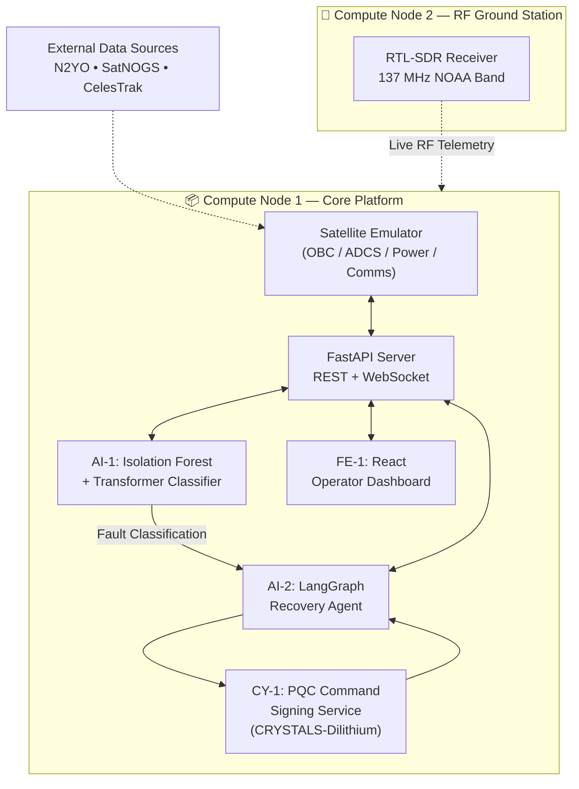
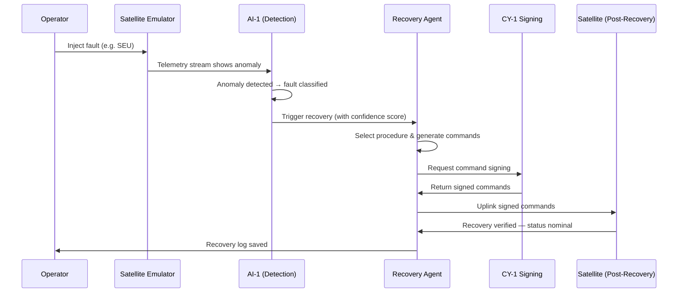

<div align="center">

# 🛰️ DeadSat Resurrection

### Autonomous Satellite Fault Detection, Classification, Recovery & Secure Command Uplink Platform

**From bricked to nominal in under 90 seconds — fully autonomously.**


**Built for FAR AWAY 2026 — Space & Aerospace × Agentic Systems × Cybersecurity**

</div>

---

## 📑 Table of Contents

- [Overview](#-overview)
- [Features](#-features)
- [Architecture](#-architecture)
- [Technical Stack](#-technical-stack)
- [Machine Learning Pipeline](#-machine-learning-pipeline)
- [Fault Taxonomy](#-fault-taxonomy)
- [Repository Structure](#-repository-structure)
- [Installation](#-installation)
- [Quick Start](#-quick-start)
- [API Documentation](#-api-documentation)
- [Demo](#-demo)
- [Security](#-security)
- [Performance](#-performance)
- [Future Work](#-future-work)
- [Contributors](#-contributors)
- [License](#-license)

---

## 🌍 Overview

### The Problem

When a satellite experiences an onboard fault — a bit-flip from a cosmic ray, a software crash loop, corrupted firmware, or a rogue command — recovery is a slow, manual, human-driven process. Engineers must:

1. Wait for a ground contact window
2. Manually analyze downlinked telemetry
3. Diagnose the fault type
4. Draft and review a recovery procedure
5. Wait for the next contact window
6. Manually uplink and verify commands

This process typically takes **48–96 hours** per incident — even for well-understood fault classes.

### The Solution

**DeadSat Resurrection** is an end-to-end autonomous pipeline that takes a satellite from **fault detected → fault classified → recovery planned → commands cryptographically signed → uplinked → verified nominal**, with no human in the loop.

```
Live Telemetry → Anomaly Detection → Fault Classification → Recovery Planning → Secure Uplink → Verified Nominal
```

### Impact

| Metric | Traditional Recovery | DeadSat Resurrection |
|---|---|---|
| **Time to recovery** | 48–96 hours | **< 90 seconds** |
| **Human involvement** | Manual, multi-team | Fully autonomous |
| **Command authentication** | Manual review | Post-quantum signed (CRYSTALS-Dilithium) |
| **Fault diagnosis** | Manual telemetry inspection | ML-driven (Isolation Forest + Transformer) |

---

## ✨ Features

- 🧠 **AI Fault Detection** — A Transformer-based classifier identifies the specific fault category (SEU, software bug, firmware corruption, command injection) from orbital and telemetry data.
- 🔍 **Anomaly Detection** — An Isolation Forest model continuously monitors live telemetry and orbital parameters to flag deviations from nominal baselines in real time.
- 🤖 **Autonomous Recovery** — A LangGraph-based agent plans, sequences, and executes multi-step recovery procedures with automatic fallback logic if a procedure fails.
- 🔐 **Secure Command Uplink** — Every recovery command is digitally signed using **CRYSTALS-Dilithium**, a NIST-standardized post-quantum cryptographic algorithm, before transmission.
- 📡 **Real-Time Telemetry** — Live telemetry frames are streamed to the operator dashboard at 1Hz over WebSockets, with full historical playback.
- 🌐 **Orbital Intelligence** — Live orbital mechanics (TLE-based) drive ground contact window predictions and feed anomaly baselines for a 712-satellite reference catalog.

---

## 🏗️ Architecture



**Pipeline summary:**

1. The **Satellite Emulator** generates realistic telemetry across four subsystems (OBC, ADCS, Power, Comms).
2. **AI-1** continuously scores telemetry for anomalies and classifies confirmed faults.
3. **AI-2's LangGraph agent** selects and executes a recovery procedure based on fault type and confidence.
4. **CY-1's signing service** cryptographically signs every command before uplink.
5. **FE-1's dashboard** visualizes telemetry, fault status, and recovery progress in real time.
6. A secondary RF ground station independently receives live signals on the NOAA 137 MHz band.

---

## ⚙️ Technical Stack

### Backend
| Component | Technology |
|---|---|
| API Framework | FastAPI + Uvicorn |
| Language | Python 3.11 |
| Agent Orchestration | LangGraph 1.2.4, LangChain Core 1.4.2 |
| Real-time Transport | WebSocket + REST |

### Machine Learning
| Component | Technology |
|---|---|
| Framework | PyTorch, scikit-learn |
| Anomaly Detection | Isolation Forest |
| Fault Classification | Transformer Encoder (TLE-based) |
| Training Data | 712-satellite catalog, 1,860+ training sequences |

### Security
| Component | Technology |
|---|---|
| Command Signing | CRYSTALS-Dilithium (liboqs) |
| Standard | NIST Post-Quantum Cryptography (2024) |
| Validation | Confidence-gated execution thresholds |

### Orbital Mechanics
| Component | Technology |
|---|---|
| Propagation | sgp4 2.23 |
| Live Tracking | N2YO API |
| Telemetry Reference | SatNOGS DB |
| TLE Fallback | CelesTrak |

### Frontend
| Component | Technology |
|---|---|
| Framework | React |
| Realtime Updates | WebSocket |
| Data Layer | REST API |

---

## 🧬 Machine Learning Pipeline

```
Live Telemetry → Isolation Forest → Transformer Encoder → Fault Classification → Recovery Agent
```

### 1. Inputs

The pipeline consumes two complementary data streams:

- **Live telemetry frames** (1Hz): OBC status, ADCS rates/quaternion, power/battery state, comms link quality.
- **Orbital elements (TLE-derived)**: `MEAN_MOTION`, `ECCENTRICITY`, `INCLINATION`, `RA_OF_ASC_NODE`, `ARG_OF_PERICENTER`, `MEAN_ANOMALY`, `BSTAR`, `MEAN_MOTION_DOT`, `REV_AT_EPOCH`.

### 2. Feature Engineering

From the raw orbital elements, the pipeline derives:

- `ECC_DELTA` — deviation in orbital eccentricity from baseline
- `REV_DELTA` — change in revolution count between epochs
- `TLE_AGE_HOURS` — age of the most recent orbital element set
- `BSTAR_ANOMALY` — deviation in drag coefficient
- `MEAN_MOTION_ANOMALY` — deviation in mean motion from expected baseline

### 3. Model Architecture

- **Stage 1 — Isolation Forest**: An unsupervised ensemble model trained on nominal telemetry and orbital baselines for 712 reference satellites. Flags incoming frames whose feature vectors fall outside the learned "normal" envelope.
- **Stage 2 — Transformer Encoder**: A sequence-based classifier that takes the derived orbital features and predicts one of four fault categories with an associated confidence score.

### 4. Training Process

- The model is trained on `training_baselines.csv`, an exported set of orbital and telemetry baselines covering 712 satellites.
- Synthetic fault injection generates labeled sequences across all four fault categories (SEU, software bug, firmware corruption, command injection), producing 1,860+ training sequences.
- Models are versioned (`V2`, `tle`) to track iterations as feature design evolved toward an orbital-mechanics-centric approach.

### 5. Inference Process

1. A new telemetry/orbital frame arrives.
2. The Isolation Forest computes an anomaly score against the satellite's baseline.
3. If anomalous, derived features are passed to the Transformer Encoder.
4. The Transformer outputs a fault class and confidence score.
5. If confidence meets the fault's minimum threshold, the result is forwarded to the **Recovery Agent**.

---

## 🩺 Fault Taxonomy

| Fault | Detection Method | Recovery |
|---|---|---|
| **SEU** (Single Event Upset) | `ECC_DELTA > 0.01` | `ADCS_MEMORY_SCRUB_v2` → fallback `OBC_SOFT_REBOOT_v1` |
| **Software Bug** | `REV_DELTA ≤ 0` | `OBC_SOFT_REBOOT_v1` → fallback `OBC_HARD_RESET_v1` |
| **Firmware Corruption** | Abnormal `BSTAR` or `MEAN_MOTION_DOT` | `FIRMWARE_ROLLBACK_v1` → fallback `SAFE_MODE_HOLD` |
| **Command Injection** | `TLE_AGE_HOURS > 72` | `LOCKDOWN_REGEN_v1` → fallback `COMMS_HARD_RESET_v1` |

> Each fault category has a **minimum confidence threshold** that must be met before a recovery procedure executes. Irreversible procedures (e.g., firmware rollback) require a higher threshold than reversible ones — see [Security](#-security).

---

## 📁 Repository Structure

```
DEADSAT-RESURRECTION/
├── agents/
│   ├── recovery_agent.py            # LangGraph recovery pipeline
│   └── procedure_library.json       # Fault → procedure → fallback mapping
├── emulator/
│   ├── satellite_emulator.py        # OBC/ADCS/Power/Comms state machine
│   ├── contact_calculator.py        # Orbital mechanics & contact windows
│   └── real_data_fetcher.py         # Live orbital data integration
├── models/
│   ├── satellite_fault_classifier.py
│   ├── satellite_fault_classifier_V2.py
│   └── satellite_fault_classifier_tle.py
├── data/
│   ├── input.csv                    # General satellite catalog
│   ├── input__1_.csv                # CubeSat subset
│   ├── input__2_.csv                # Amateur radio satellite subset
│   └── training_baselines.csv       # ML training export
├── docs/
│   ├── deadsat_postman_collection.json
│   ├── Satellite_Fault_Recovery_Design.docx
│   └── CHANGES_V1_TO_V2.md
├── main.py                           # FastAPI application entrypoint
├── real_data_fetcher.py
├── satellite_catalog.py              # Satellite catalog & TLE builder
├── requirements.txt
├── .env.example
└── README.md
```

---

## 🔧 Installation

### Prerequisites

- Python 3.11+
- `pip` and a virtual environment tool (recommended: `venv`)
- (Optional) API credentials for live orbital data sources

### 1. Clone the repository

```bash
git clone https://github.com/DevashyaManojbhaiJethva/DEADSAT-RESURRECTION.git
cd DEADSAT-RESURRECTION
```

### 2. Install dependencies

```bash
python -m venv venv
source venv/bin/activate   # Windows: venv\Scripts\activate
pip install -r requirements.txt
```

### 3. Configure environment variables

Copy the example environment file and fill in your own credentials:

```bash
cp .env.example .env
```

**`.env.example`**

```env
# --- External Orbital Data Providers (optional, for live data) ---
N2YO_API_KEY=YOUR_API_KEY
SATNOGS_TOKEN=YOUR_TOKEN

# --- Target Satellite ---
TARGET_NORAD=YOUR_NORAD_ID

# --- Server Configuration ---
APP_HOST=0.0.0.0
APP_PORT=8000
SIGNING_SERVICE_PORT=8001
```

> ⚠️ Never commit a real `.env` file. `.env` is excluded via `.gitignore`. If live data sources are unavailable, the system automatically falls back to the bundled local satellite catalog — no external credentials are required to run the demo.

---

## 🚀 Quick Start

```bash
# 1. Activate your virtual environment
source venv/bin/activate

# 2. Start the FastAPI server (telemetry, recovery agent, signing service)
python main.py

# 3. Open the interactive API documentation
#    http://localhost:8000/docs

# 4. (Optional) Start the React dashboard
cd frontend
npm install
npm start
#    http://localhost:3000
```

Once running, the dashboard will display live telemetry, and you can trigger a simulated fault to watch the full detection → recovery → verification pipeline run end-to-end.

---

## 📡 API Documentation

All endpoints are served from the FastAPI application (`main.py`). Interactive Swagger documentation is available at `/docs` when the server is running.

| Method | Endpoint | Description |
|---|---|---|
| `GET` | `/health` | Returns the current status of all four subsystems (OBC, ADCS, Power, Comms) |
| `GET` | `/telemetry` | Returns the latest telemetry frame |
| `GET` | `/telemetry/history` | Returns a sliding window of recent telemetry frames |
| `GET` | `/contact` | Returns the next ground contact window for the target satellite |
| `POST` | `/fault/inject` | Injects a simulated fault for demonstration and testing |
| `POST` | `/recovery/trigger` | Initiates the autonomous recovery pipeline |
| `POST` | `/reset` | Resets the satellite emulator to a nominal state |
| `GET` | `/catalog/satellite/{norad_id}` | Returns orbital elements, TLE, and baseline data for a satellite |
| `GET` | `/catalog/search` | Searches the satellite catalog by name |
| `GET` | `/catalog/stats` | Returns summary statistics for the satellite catalog |
| `GET` | `/catalog/baselines` | Returns baseline data used for anomaly model training |
| `WS` | `/ws/telemetry` | Streams live telemetry frames to connected clients |
| `WS` | `/ws/events` | Streams recovery pipeline status events to connected clients |

### Example: Telemetry Frame Schema

```json
{
  "timestamp": 1718000000,
  "frame_id": 42,
  "obc_status": "nominal",
  "obc_temp_c": 47.2,
  "adcs_rate_deg_s": 0.003,
  "adcs_pointing_err_deg": 0.001,
  "adcs_status": "nominal",
  "power_w": 82.4,
  "battery_pct": 91.2,
  "power_status": "nominal",
  "comms_uplink": true,
  "comms_downlink": true,
  "signal_strength_dbm": -78.3,
  "comms_status": "nominal",
  "fault_injected": null
}
```

---

## 🎬 Demo

The full pipeline runs in under 90 seconds, from fault injection to verified recovery:



**Narrative walkthrough:**

1. **Dashboard loads** — all subsystems report nominal, live orbital position is displayed.
2. **Fault injected** — e.g., a Single Event Upset is simulated on the ADCS subsystem.
3. **Anomaly detected** — the Isolation Forest flags the deviation within seconds.
4. **Fault classified** — the Transformer model confirms the fault type and confidence.
5. **Recovery triggered** — the LangGraph agent selects the appropriate procedure.
6. **Commands signed** — the recovery commands are cryptographically signed.
7. **Commands uplinked** — signed commands are transmitted to the satellite.
8. **Recovery verified** — telemetry confirms the subsystem has returned to nominal, and a recovery log is persisted for audit.

---

## 🔐 Security

DeadSat Resurrection is designed with the assumption that **command authenticity is mission-critical** — an attacker who can inject unauthorized commands into a satellite's uplink poses a serious risk. The platform addresses this with several layers of protection.

### Post-Quantum Cryptography

All recovery commands are signed using **CRYSTALS-Dilithium**, a digital signature scheme selected by NIST as a 2024 post-quantum cryptography standard. This ensures that command integrity and authenticity remain protected even against future quantum-capable adversaries.

### Secure Command Signing

Every command generated by the recovery agent passes through a dedicated signing service before uplink. Commands are signed as a batch, creating a verifiable record tied to the recovery run that produced them.

### Recovery Validation

Recovery procedures are gated by **confidence thresholds**:

- Each fault type has a minimum classification confidence required before any recovery action is taken.
- **Irreversible procedures** (such as a firmware rollback) require a substantially higher confidence threshold than reversible procedures (such as a memory scrub or soft reboot).
- If the primary procedure does not resolve the fault, the agent automatically falls back to a secondary procedure — and ultimately to a safe-hold state if all options are exhausted.

### Credential Management

All third-party API credentials (orbital data providers) are loaded from environment variables and are never hardcoded or committed to the repository. The system is fully functional using a bundled local satellite catalog if external credentials are not configured.

> For responsible disclosure of any security concerns, please open a private security advisory on this repository rather than a public issue.

---

## 📊 Performance

### API Test Suite Results

Validated via an automated test runner across all public endpoints:

| Metric | Result |
|---|---|
| Total Assertions | 78 |
| Passed | 72 |
| Failed | 6 |
| **Pass Rate** | **92.3%** |
| Average Response Time | 224 ms |
| Total Suite Duration | 4.7 s |

### Recovery Pipeline Timing

| Stage | Cumulative Time |
|---|---|
| Fault injected | T+05s |
| Anomaly detected on live telemetry | T+15s |
| Recovery agent triggered | T+20s |
| Procedure selected | T+23s |
| Commands generated | T+24s |
| Commands signed (CRYSTALS-Dilithium) | T+25s |
| Commands uplinked | T+27s |
| Recovery verified — system nominal | **T+30s** |

---

## 🛣️ Future Work

- [ ] Real CubeSat hardware deployment
- [ ] CCSDS packet protocol support
- [ ] SDR-based telemetry decoding from live RF
- [ ] Multi-satellite constellation support
- [ ] Reinforcement-learning-based recovery optimization
- [ ] Autonomous long-horizon mission planning

---

## 👥 Contributors

| Role | Responsibility |
|---|---|
| **AI-1** | Anomaly detection (Isolation Forest) and fault classification (Transformer Encoder, TLE-based) |
| **AI-2** | Satellite emulator, LangGraph recovery agent, FastAPI backend, orbital data integration |
| **FE-1** | React dashboard and real-time telemetry visualization |
| **FE-2** | Frontend–backend integration and API wiring |
| **CY-1** | Post-quantum command signing service and recovery audit ledger |

---

## 📄 License

This project is licensed under the **MIT License**.

```
MIT License

Copyright (c) 2026 DeadSat Resurrection Team

Permission is hereby granted, free of charge, to any person obtaining a copy
of this software and associated documentation files (the "Software"), to deal
in the Software without restriction, including without limitation the rights
to use, copy, modify, merge, publish, distribute, sublicense, and/or sell
copies of the Software, subject to the following conditions:

The above copyright notice and this permission notice shall be included in all
copies or substantial portions of the Software.

THE SOFTWARE IS PROVIDED "AS IS", WITHOUT WARRANTY OF ANY KIND, EXPRESS OR
IMPLIED, INCLUDING BUT NOT LIMITED TO THE WARRANTIES OF MERCHANTABILITY,
FITNESS FOR A PARTICULAR PURPOSE AND NONINFRINGEMENT.
```

See the [LICENSE](LICENSE) file for full details.

---

<div align="center">

**FAR AWAY 2026 — Recovering Satellites in Seconds, Not Days.**

🚀 Space × AI × Cybersecurity 🔐

</div>
